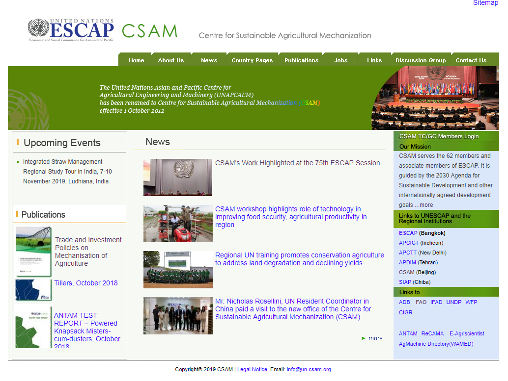
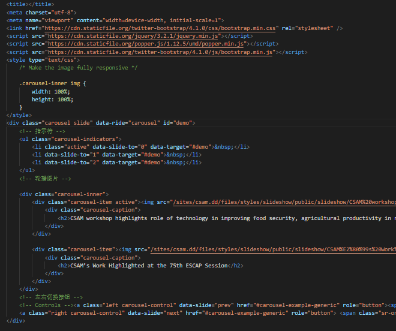
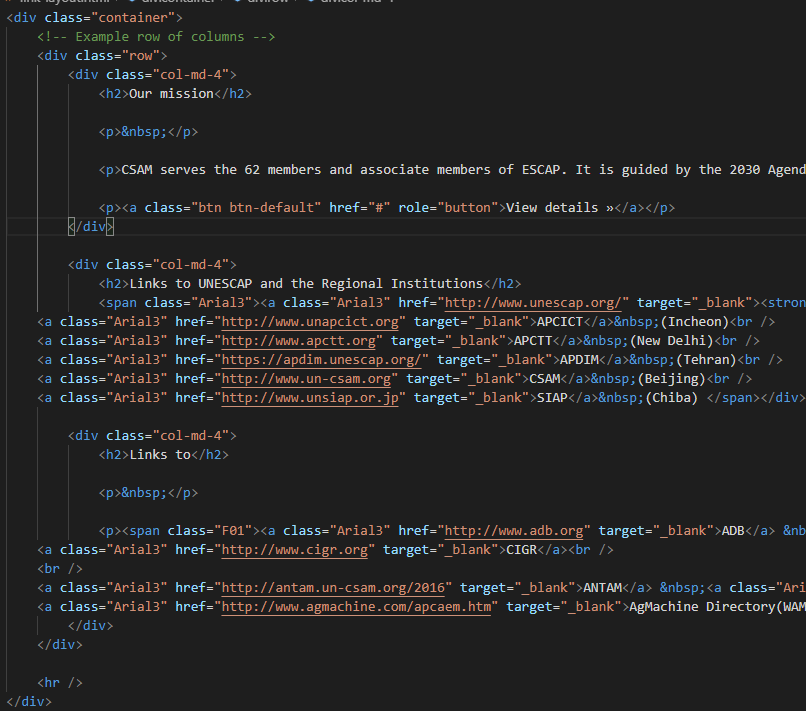
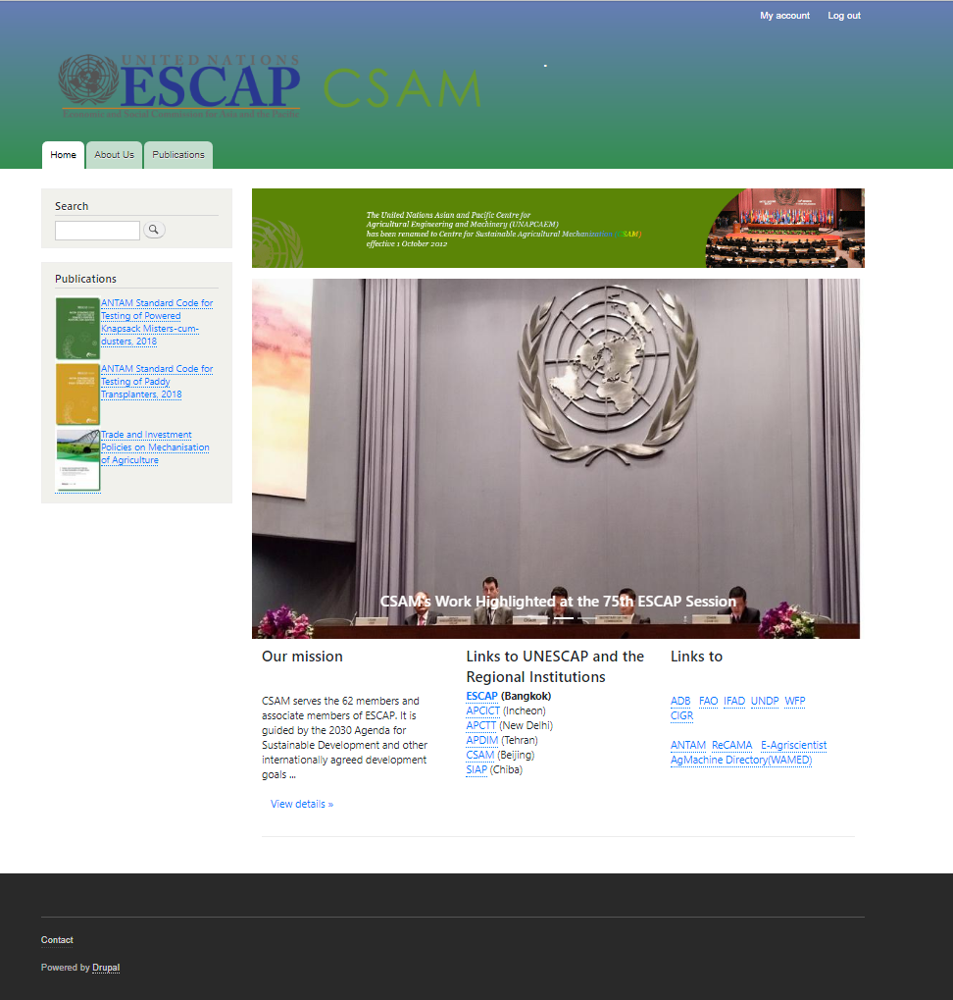

# Install
+ Acquia Dev Desktop 2
+ php >= 7.2.18
+ drupal >= 8.7.6

---
1. Dowload Acquia Dev Desktop. Link:   https://www.acquia.com/drupal/acquia-dev-desktop
2. Install the Acquia Dev Desktop in your folder, you can install it at the D:\DevDesktop or anywhere you want
3. Dowload Drupal. Link:   https://www.drupal.org/download
4. Unzip the file and put it in the D:\env-website or anywhere you want. Rename the `drupal` to `csam` or `yourwebsitename`

# Build the drupal
1. Launch the Acquia Dev Desktop choose `import local drupal site`,choose the `csam` folder and the php version `7.2.18`
2. Click the `Local site` from the Acquia Dev Desktop and fill out the drupal installation settings.
3. The webpage after building steps:


# How to use drush
1. Launch the Acquia Dev Desktop, click the cmd logo.
2. Download appearance: ```drush dl bootstrap```
3. Download module:   ```drush en module_name```
4. Install module:   ```drush en empty_front_page -y```
5. Clear the cashe: ```drush cr``` or 
```drush cache-clear drush```

# Add the files and pictures
1. Add slideshow by Home --> Administration --> Structure --> Block layout
2. Add Links and mission by Home --> Administration --> Structure --> Block layout,then `Edit custom block` and input the HTML and title of this block.
3. For the publication part, Home --> Administration --> Structure --> Add content type,then add the customized content type `publication` which includes picture/ title/ body. Type-in all the publication content and add the publications Views from the `Add view` that display at the `Block
Page (/publications)`
4. Appearance --> your theme -->setting, choose the color and close the display of theme logo.
The initial page in the http://www.un-csam.org/


##  Slideshow
1. Home --> Administration --> Block layout --> content --> Custom block library
2. Input the `Slideshow` in the block description, choose `Full Html` and input the html source code in `code\slideshow.html` to the body.

3. Home --> Administration --> Block layout --> content --> place block, add `Slideshow` content to the front page (the block in the content will be shown in the front page).

## Link Layout
1. Home --> Administration --> Block layout --> content --> Custom block library
2. Input the `Layout` in the block description, choose `Full Html` and input the html source code in `code\link-layout.html` to the body.
3. Home --> Administration --> Block layout --> content --> place block, drap the `Layout` under the `Slideshow`

## Publications
1.  Home --> Administration --> Structure --> Add content type.Then add `publications` as new content type.
2.  Choose the Manage fields, add `body` (Text), `publications`(File), `field_image`(Image) as fields of the publications.
3. Add the content. Make sure that 	
`CONTENT TYPE` is `publications`.
4. Home --> Administration --> Structure --> Views, add views for publications.In the `VIEW SETTINGS`,Show  Content of type `publications`.
5. If you want to add a webpage for the publication, click the `Create a page` in the PAGE SETTINGS.  If you want to add a block on the front page, click the `Create a block` in the BLOCK SETTINGS.
6. In the PAGE SETTINGS and BLOCK SETTINGS, choose Display format `Bootstrap Media Object` of fields.
7. Here is the Views Displays setting:
```
FORMAT
    Format:Bootstrap Media Object | Settings
FIELDS
    Content: Title
    Content: Image
    Content: Body
FILTER CRITERIA
    Content: Published (= Yes)
    Content: Content type (= publications)
```
8. Home --> Administration --> Configuration --> Media -->Image styles --> add Image Styles, Change the 
EFFECT	OPERATIONS to `Scale and crop 70×100`.
9. In the Image field content, choose your Image style that toin the Configuration.
10. Home --> Administration --> Structure --> Block Layout --> Siderbar first --> Place block , choose the views `Publications: Block` from the Category of Lists (Views).

## Appearance
1. Add picture in the front page: Home --> Administration --> Structure --> Block layout --> Add block, write the title and remove the `display title`, Visibility --> Pages --> Show for the listed pages
2. In the Block --> Edit custom block, in the body upload the picture will be shown in the front.
2. Home --> Administration --> Appearance --> Appearance settings --> Bartik.Here is my COLOR SCHEME:
```
Header background top
#667db6
Header background bottom
#348F50
Main background
#ffffff
Lock
Sidebar background
#f1f1ec
```
3. In the LOGO IMAGE, remove the logo supplied by the theme and choose the logo image from local folder.
4. Home --> Administration --> Structure --> Views --> Front --> edit, change the TITLE to `Welcome to Centre for Sustainable Agricultural Mechanization`


## Problem Soving and Tools
###  Change Maximum upload size limit
+ Go go the folder where the Acquia Dev Desktop installed and find the correct php version. I installed it in the `D:\DevDesktop\php7_2_x64\` ， change the `post_max_size = 8M` and `upload_max_filesize = 2M` in the file `php.ini` 
+ Go go the folder where the drupal installed and find the htaccess. I found it at the `D:\env-website\csam\.htaccess`, change the old file 
```
# PHP 5, Apache 1 and 2.
<IfModule mod_php5.c>
  php_value assert.active                   0
  php_flag session.auto_start               off
```
to the 
```
# PHP 5, Apache 1 and 2.
php_value post_max_size 8M
php_value upload_max_filesize 8M
<IfModule mod_php5.c>
  php_value assert.active                   0
  php_flag session.auto_start               off
```
### Use the Git for version control
Download the git from https://git-scm.com/ 
, then add the ```"git.path": "D:/software/Git/bin/git.exe"``` to the `settings.json`

### Export Markdown File
Add the `Markdown PDF` extension and right click the markdown file, you can export it to a png/jpg/html/pdf.

# Final result
The front page after the content migration:
