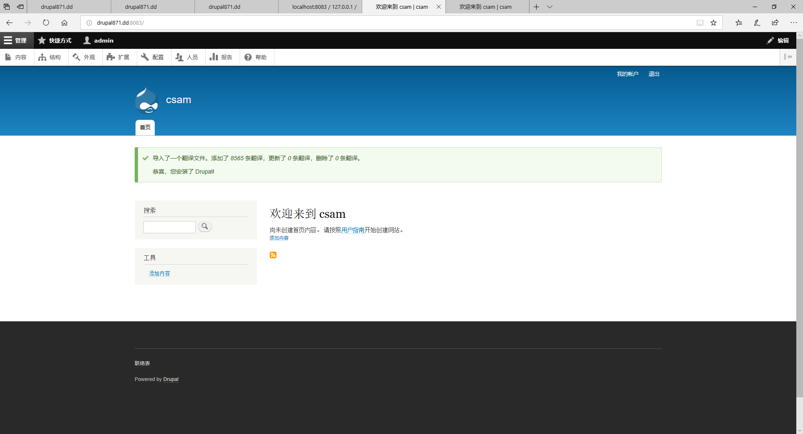
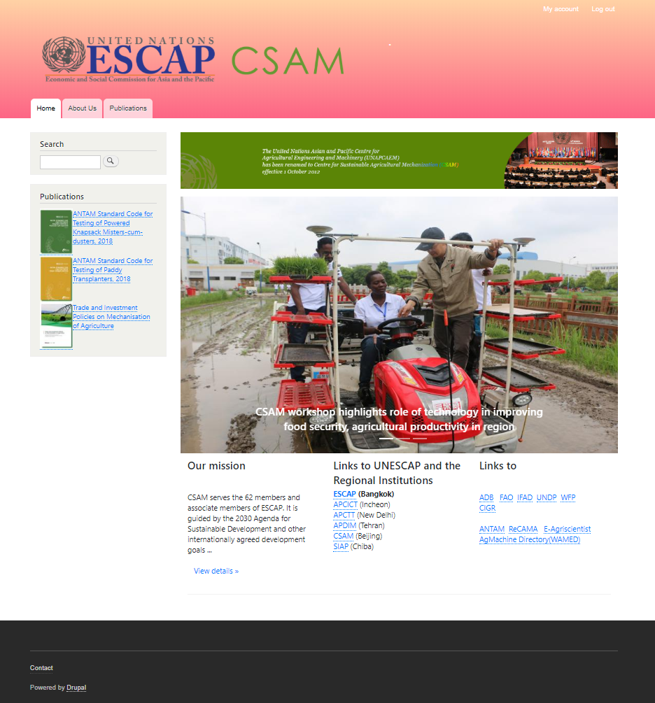

# Install
+ Acquia Dev Desktop 2
+ php >= 7.2.18
+ drupal >= 8.7.6

-------
1. Dowload Acquia Dev Desktop. Link:   https://www.acquia.com/drupal/acquia-dev-desktop
2. Install the Acquia Dev Desktop in your folder, you can install it at the D:\DevDesktop or anywhere you want
3. Dowload Drupal. Link:   https://www.drupal.org/download
4. Unzip the file and put it in the D:\env-website or anywhere you want.Rename the `drupal` to `csam` or `yourwebsitename`

# Build the drupal
1. Launch the Acquia Dev Desktop choose `import local drupal site`,choose the `csam` folder and the php version `7.2.18`
2. Click the `Local site` from the Acquia Dev Desktop and fill out the drupal installation settings.
3. The webpage after building steps:


# How to use drush
1. Launch the Acquia Dev Desktop, click the cmd logo.
2. Download appearance: ```drush dl bootstrap```
3. Download module:   ```drush en module_name```
4. Install module:   ```drush en empty_front_page -y```
5. Clear the cashe: ```drush cr``` or 
```drush cache-clear drush```


# Add the files and pictures
1. Add slideshow by Home --> Administration --> Structure --> Block layout
2. Add Links and mission by Home --> Administration --> Structure --> Block layout,then `Edit custom block` and input the HTML and title of this block.
3. For the publication part, Home --> Administration --> Structure --> Add content type,then add the customized content type `publication` which includes picture/ title/ body. Type-in all the publication content and add the publications Views from the `Add view` that display at the `Block
Page (/publications)`
4. Appearance --> your theme -->setting, choose the color and close the display of theme logo.
5. The front page after the content migration:

